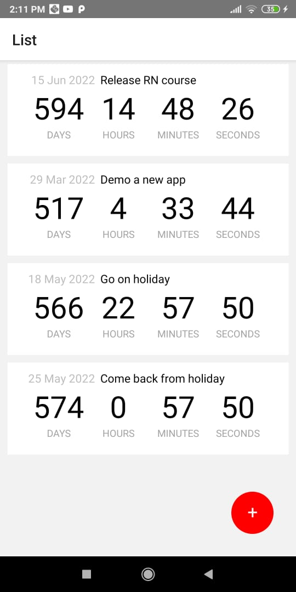
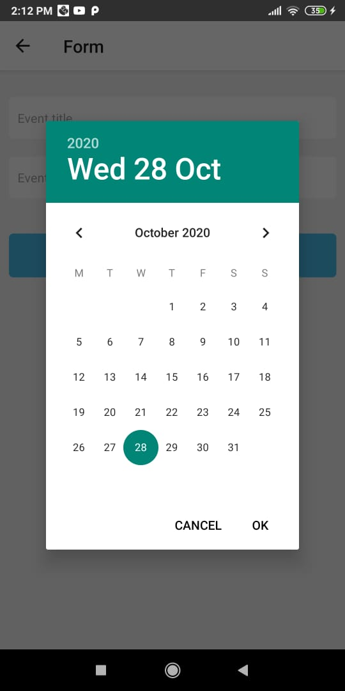
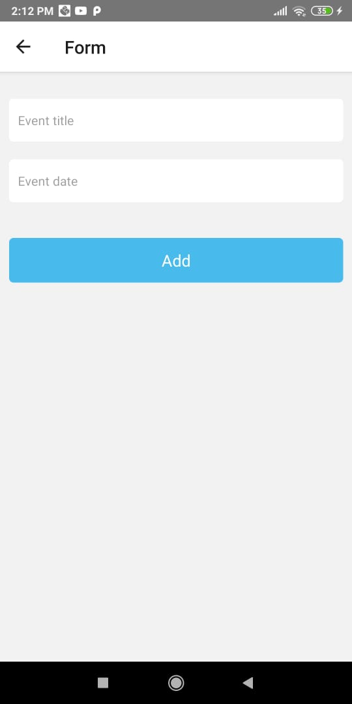

# react-native-countdown
A practice app made by following this tutorial [React Native: Getting Started ](https://app.pluralsight.com/library/courses/react-native-getting-started/description)

# Important Points

1. Follow this link [Environment setup](https://reactnative.dev/docs/environment-setup) to create react native application. I followed the *React Native CLI Quickstart*.

2. I suggest you to go through *package.json* first and install the packages before starting the application.

3. For mock rest api as mentioned in the course I used [JSON SERVER](https://www.npmjs.com/package/json-server). I was testing the app on my android phone so you might face an issue
    which is you wont be able to call the https://localhost:3000/events api from your phone. I found the fix at [stackoverflow](https://stackoverflow.com/questions/63132453/unable-to-reach-json-server-from-fetch-in-react-native-app/63133395#comment114204542_63133395)
    Make sure your phone and android device are using the same internet. 

 

 

